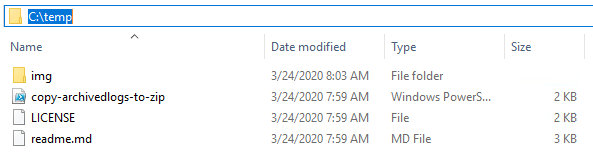
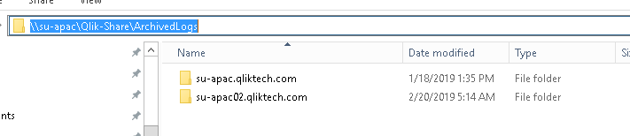
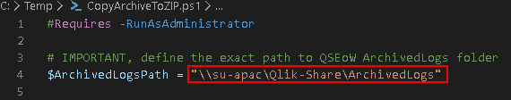
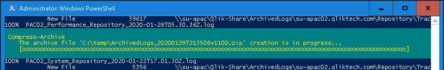
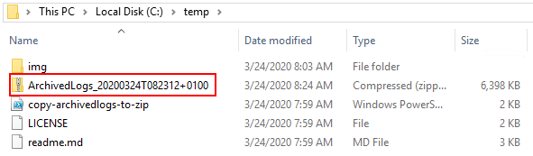
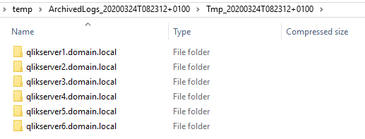
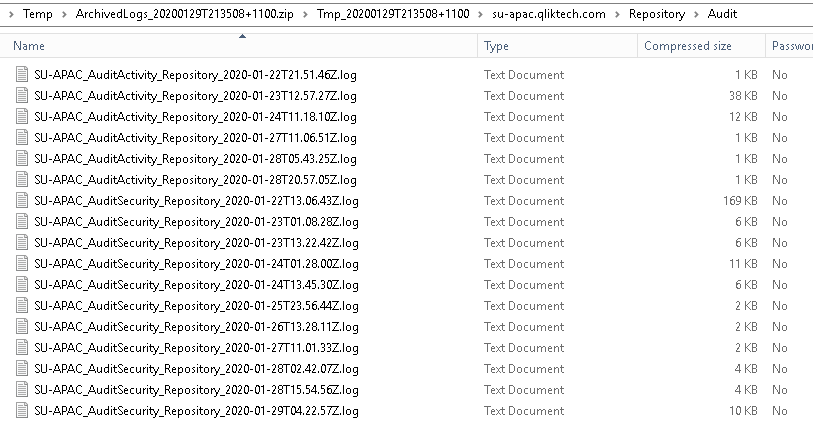

# PowerShell: Collect Archived Logs From Qlik Sense Enterprise On Windows

​​​​​Qlik Sense Log Collector tool ([https://support.qlik.com/articles/000006144
](https://support.qlik.com/articles/000006144
)) is the primary tool for collecting log files from a Qlik Sense on windows deployment as described in How To Collect Log Files From Qlik Sense Enterprise on Windows 

In cases where Qlik Sense Log Collector is unable to collect the desired Qlik Sense archived logs, it may be possible to collect logs using PowerShell instead of manually collecting the log files. Below is an example of a simple PowerShell script that utilizes native Windwos Server functions to copy files from the archived log folder and compresses them to a ZIP file. 

## Instructions

NOTE: The script will collect archived logs for the past seven (7) days. 

1.	Download file https://github.com/tonikautto/qseow-copy-archivedlogs-ps1/archive/master.zip 
1.	Unzip file in any folder, for example c:\temp   
1.	Browse to your Qlik Sense Archived log folder 
1.	Copy the folder path 
1.	Edit CopyArchiveToZIP.ps1 in any text editor 
1.	Set ArchivedLogsPath variable to the archived log folder path 
1.	Save the file and close the text editor
1.	Run PowerShell prompt As Administrator 
1.	Change directory to same as location of CopyArchiveToZIP.ps1 
1.	Run PS1 file  
1.	RoboCopy output lists all files that get copied
1.	ZIP compression progress is shown as ZIP is generated 
1.	Prompt is show again when process is finished 
1.	ZIP file with last 7 days of archived logs is stored in same folder as PS1 file  
1.	Double click on ZIP file to view its content
1.	Confirm that it has sub folder for each node 
1.	Browse further and sanity check that at least one folder has files from only the latest 7 days 
1.	Attach ZIP file to support case

## License
This project is provided "AS IS", without any warranty, under the MIT License - see the [LICENSE](LICENSE) file for details