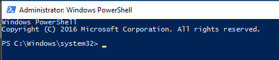

# PowerShell: Collect Archived Logs From Qlik Sense Enterprise On Windows

 [​​​​​Qlik Sense Log Collector](https://support.qlik.com/articles/000006144) is the primary tool for collecting log files from a Qlik Sense on Windows deployment. 

In cases where Qlik Sense Log Collector is unable to collect the desired Qlik Sense archived logs, it may be possible to collect logs using PowerShell instead of manually collecting the log files. Below is an example of a simple PowerShell script that utilizes native Windwos Server functions to copy files from the archived log folder and compresses them to a ZIP file. 

## Instructions

NOTE: The script will collect archived logs for the past seven (7) days. 

1. Download file https://github.com/tonikautto/qseow-copy-archivedlogs-ps1/archive/master.zip 
2. Unzip file in any folder, for example c:\temp   

3. Browse to your Qlik Sense Archived log folder 
4. Copy the folder path 

5. Run PowerShell prompt As Administrator 

6. Change directory to same as location as in Step 2 
`cd c:\temp`
7. Execute PS1 file, where `<ARCHIVE_LOGS_PATH>` is replaced with the path copied in Step 4.  
`.\copy-archivedlogs-to-zip.ps1 -ArchivedLogsPath "<ARCHIVE_LOGS_PATH>"`
8.	ZIP file with collected archived log files is stored in same folder as PS1 file  
9.	Double click on ZIP file to view its content
1.	Confirm that it has sub folder for each node 

## License
This project is provided "AS IS", without any warranty, under the MIT License - see the [LICENSE](LICENSE) file for details